# Implementation Plan: Level 4 Production Upgrade

## Overview

This implementation plan breaks down the Level 4 Production Upgrade into 31 discrete tasks covering infrastructure modernization, mobile-responsive UI, production operations monitoring, user validation, and comprehensive documentation. Tasks are organized to allow parallel execution where dependencies permit, with infrastructure and deployment tasks as foundational work followed by UX improvements, monitoring, user testing, and documentation.

## Tasks

- [ ] 1. Update Railway project configuration with project ID `5cc5d4b8-aa32-4e6a-b0c9-d3538b20add0`, verify environment variables, PostgreSQL connection, restart policy, and health check endpoints. Test backend deployment on Railway. Document configuration in DEPLOY.md. **Requirements:** 1, 6

- [ ] 2. Verify Vercel frontend deployment configuration, confirm GitHub linkage, environment variables, Vercel Analytics, deployment URL accessibility, and CORS with backend. Document in DEPLOY.md. **Requirements:** 6

- [ ] 3. Verify smart contract deployment at address `CAI52UIAHEMT3SNQ2EXOJKHHC2PAGLGURZYNL6HFZJ6LL5KDQFURBQUH` and USDC token at `CAATNNYENLGM6JUS522SLKU2BYHHLN5PYI7XNRJXP7CE2KESE7P52FW5`. Test all contract functions, run test suite, and document addresses in README. Update environment variables. **Requirements:** 2, 6, 13

- [ ] 4. Implement mobile-responsive design for all UI components. Define breakpoints (mobile: 320-640px, tablet: 641-1024px, desktop: 1025px+). Update navigation with hamburger menu, make cards responsive, ensure full-width forms on mobile, increase tap targets to 44x44px minimum. Test on Chrome DevTools, real iOS and Android devices. Capture screenshots for 320px, 768px, 1920px viewports. Save to `docs/screenshots/mobile_responsive.png`. **Requirements:** 3, 15

- [ ] 5. Create `LoadingSpinner` component with animated SVG. Add loading overlays to forms, skeleton loaders for lists, progress indicators for transactions. Wrap all API calls with loading state management. Ensure states clear on success/error. Add 30-second timeout handling. Test all user flows. **Requirements:** 4, 15

- [ ] 6. Create `ErrorAlert` component with dismissible UI. Add error boundaries to pages, inline validation for forms, toast notifications for transient errors. Implement retry/refresh/go-back actions. Handle HTTP status codes (400, 401, 403, 404, 409, 500, 502, 503). Add user-friendly blockchain error messages. Test all error scenarios. Log errors to analytics. **Requirements:** 4, 9, 15

- [ ] 7. Configure Pino logger in `lib/logger.ts`. Set log level based on NODE_ENV. Add request/response logging middleware logging method, path, status, latency. Log all errors with stack traces, database queries with execution time, Stellar transactions with results. Redact sensitive data. Test log output in Railway console. **Requirements:** 7, 9

- [ ] 8. Create `/api/metrics` endpoint exposing system telemetry. Track in-memory counters for requests, errors, latency. Calculate error rate and average latency. Collect system metrics (uptime, memory, Node version), database pool metrics (total, idle, waiting connections), count total shipments. Expose network config (Stellar network, RPC URL, contract address). Test endpoint returns all fields. **Requirements:** 7

- [ ] 9. Install `@vercel/analytics` package. Add Analytics component to root layout. Configure in Vercel dashboard. Verify page view tracking. Add custom events for key actions (create shipment, accept, confirm). Implement error tracking for unhandled exceptions with user context (wallet, page, action). Test events in Vercel dashboard. Capture screenshot of analytics dashboard. **Requirements:** 7

- [ ] 10. Enable Next.js automatic code splitting. Implement lazy loading for heavy components (Analytics page). Optimize images with Next.js Image component. Add compression for static assets. Minimize bundle with tree shaking. Run Lighthouse audit achieving score >90. Measure initial load time. Verify navigation <500ms. Test on standard broadband. **Requirements:** 8

- [ ] 11. Add database indexes on foreign keys (shipper_id, driver_id) and frequently queried columns (status, created_at). Implement connection pooling (max 20). Optimize SQL queries with EXPLAIN. Add rate limiting middleware (100 req/min per IP). Implement 30-second query timeout. Test response times under load. Verify p95 <2s. Document indexes in schema.sql. **Requirements:** 8

- [ ] 12. Implement exponential backoff for database reconnection. Add retry logic for Stellar requests (max 3 attempts). Add jitter (±20%) to backoff. Implement timeout handling for external requests. Distinguish retryable (502, 503, 504) from non-retryable errors (400, 401, 403, 404). Test reconnection and retry scenarios. Log all retry attempts. **Requirements:** 9

- [ ] 13. Add Zod schema validation for all API endpoints. Use parameterized SQL queries. Implement CORS with frontend URL whitelist. Add rate limiting (100 req/min per IP). Verify transaction XDR before submission. Redact sensitive data from logs. Add security headers (helmet middleware). Test SQL injection prevention and rate limiting. **Requirements:** 12

- [ ] 14. Navigate to contracts directory. Run `cargo test` for all tests. Verify all pass. Review coverage for create, accept, confirm, cancel functions. Verify authorization failure and payment lock/release tests. Document results. Fix any failures. **Requirements:** 13

- [ ] 15. Test CORS headers on all endpoints. Test error response handling (400, 404, 500). Test complete shipment flow (build XDR → sign → submit). Test signature verification and hash return. Test all state transitions. Verify Freighter wallet integration. Test on Chrome, Firefox, Safari. **Requirements:** 14

- [ ] 16. Write user onboarding guide with Freighter installation, testnet XLM funding, test USDC token, and step-by-step shipment creation. Create troubleshooting section. Recruit 10+ test users. Set up communication channel (Discord/Telegram/Slack). **Requirements:** 5, 11

- [ ] 17. Provide testnet XLM and test USDC to each user. Guide through wallet connection and first shipment creation. Record wallet addresses, transaction hashes, and timestamps. Verify transactions on Stellar explorer. Ensure 10+ unique users complete interactions. Create PROOF_OF_USERS.md with verified data. **Requirements:** 5 **Depends on:** 16

- [ ] 18. Create user feedback survey. Send to all test users. Collect feedback on UX, mobile responsiveness, error handling. Conduct optional interviews. Analyze for themes. Calculate average satisfaction score. Create FEEDBACK_SUMMARY.md with insights, quotes, and suggestions. **Requirements:** 5, 11 **Depends on:** 17

- [ ] 19. Add project overview, live demo link, contract deployment address to README. Document all environment variables. Add backend, frontend, smart contract setup instructions. Document API endpoints with examples. Add troubleshooting section. Link to DEPLOY.md, PROOF_OF_USERS.md, FEEDBACK_SUMMARY.md. Verify new developer setup <30 min. **Requirements:** 11

- [ ] 20. Document all API endpoints: `/api/health`, `/api/metrics`, `GET /api/shipments`, `GET /api/shipments/:id`, `POST /api/shipments`, `POST /api/shipments/:id/submit`, `POST /api/shipments/:id/accept`, `POST /api/shipments/:id/confirm`, `POST /api/shipments/:id/cancel`, `GET /api/shipments/:id/onchain`. Include request/response examples with curl commands and status codes. Document error responses. Add to README or create API.md. **Requirements:** 11

- [ ] 21. Capture screenshots: product UI (main dashboard), mobile responsive (320px, 768px, 1920px), analytics dashboard from Vercel, error states, loading states. Save to `docs/screenshots/` as product_ui.png, mobile_responsive.png, analytics_setup.png. Reference in README. **Requirements:** 11

- [ ] 22. Write demo video script covering wallet connection, shipment creation, driver acceptance, delivery confirmation, mobile responsive design, analytics dashboard. Record screen capture with narration (5-10 min). Edit for clarity. Upload to YouTube/Loom. Add link to README. Test video plays correctly. **Requirements:** 11

- [ ] 23. Create DEPLOY.md. Document Railway and Vercel deployment processes, environment variable configuration, database migration, health check verification, rollback procedures. Add troubleshooting for common issues. Test guide by following steps. **Requirements:** 11

- [ ] 24. Review current commit count. Create meaningful commits for each feature/task with clear messages. Ensure commits show incremental progress. Verify .gitignore excludes build artifacts and node_modules. Tag commits with task numbers. Push to remote. Verify history on GitHub shows 15+ commits. **Requirements:** 10

- [ ] 25. Ensure consistent color scheme, typography, spacing across components. Add smooth transitions for state changes (200-300ms). Add loading animations (fade-in, slide-in). Create empty state components with guidance. Add confirmation dialogs for critical actions. Implement real-time form validation with visual feedback. Add success animations. Ensure clear CTAs. Test on mobile and desktop. **Requirements:** 15

- [ ] 26. Test complete shipper flow (create → wait → confirm), driver flow (accept → deliver), error scenarios, mobile layouts on real devices, cross-browser compatibility (Chrome, Firefox, Safari, Edge), wallet connection/disconnection, loading/error states, analytics tracking. Document and fix critical issues. **Requirements:** 2, 14, 15

- [ ] 27. Deploy backend to Railway with correct project ID. Verify health check returns 200 and metrics endpoint works. Deploy frontend to Vercel. Verify frontend loads successfully and communicates with backend. Verify environment variables in production. Test complete flow in production. Monitor error logs for 24 hours. Document live URLs in README. **Requirements:** 6 **Depends on:** 1, 2, 3

- [ ] 28. Configure Railway logging and Vercel Analytics dashboards. Set up uptime monitoring. Monitor error rates, API response times, database connection pool usage in first week. Review logs daily for anomalies. Document monitoring procedures in DEPLOY.md. **Requirements:** 7 **Depends on:** 27

- [ ] 29. Run Lighthouse audit on production frontend achieving score >90. Measure frontend initial load (target: <3s), API response times (p95 <2s), database query times (p95 <500ms). Test under normal load. Document metrics. Create performance baseline for future comparison. **Requirements:** 8 **Depends on:** 27

- [ ] 30. Review README, DEPLOY.md, PROOF_OF_USERS.md, FEEDBACK_SUMMARY.md, API documentation for completeness and accuracy. Verify all links work (demo, video, screenshots). Test setup instructions with fresh clone. Verify setup time <30 min. Fix issues. Get peer review. **Requirements:** 11 **Depends on:** 19, 20, 21, 22, 23

- [ ] 31. Verify Railway project ID correct, frontend/backend deployed, contract address documented, health/metrics endpoints return 200, frontend load <3s, API p95 <2s, mobile responsive 320px-2560px, loading states on all async ops, error states actionable, 10+ users onboarded with verified transactions, user feedback collected (80%+ response), 15+ commits, README complete, demo video recorded/linked, screenshots captured. Create final validation checklist. Document gaps with remediation plan. **Requirements:** 1-15 **Depends on:** 27, 29, 30

## Task Dependency Graph

```json
{
  "waves": [
    {
      "name": "Infrastructure Setup",
      "tasks": [1, 2, 3]
    },
    {
      "name": "Backend Improvements",
      "tasks": [7, 8, 11, 12, 13]
    },
    {
      "name": "UI Enhancements",
      "tasks": [4, 5, 6, 25]
    },
    {
      "name": "Frontend Optimization",
      "tasks": [9, 10]
    },
    {
      "name": "Testing",
      "tasks": [14, 15, 26]
    },
    {
      "name": "User Onboarding",
      "tasks": [16]
    },
    {
      "name": "User Testing",
      "tasks": [17]
    },
    {
      "name": "Feedback Collection",
      "tasks": [18]
    },
    {
      "name": "Documentation",
      "tasks": [19, 20, 21, 22, 23, 24]
    },
    {
      "name": "Production Deployment",
      "tasks": [27]
    },
    {
      "name": "Production Monitoring",
      "tasks": [28, 29]
    },
    {
      "name": "Final Review",
      "tasks": [30]
    },
    {
      "name": "Success Validation",
      "tasks": [31]
    }
  ]
}
```

```mermaid
graph TD
    T1[Task 1: Railway Config]
    T2[Task 2: Vercel Config]
    T3[Task 3: Smart Contract Verify]
    T4[Task 4: Mobile Responsive UI]
    T5[Task 5: Loading States]
    T6[Task 6: Error States]
    T7[Task 7: Backend Logging]
    T8[Task 8: Metrics Endpoint]
    T9[Task 9: Frontend Analytics]
    T10[Task 10: Frontend Performance]
    T11[Task 11: Backend Performance]
    T12[Task 12: Error Recovery]
    T13[Task 13: Security Hardening]
    T14[Task 14: Contract Testing]
    T15[Task 15: Integration Testing]
    T16[Task 16: Onboarding Guide]
    T17[Task 17: User Testing]
    T18[Task 18: Feedback Collection]
    T19[Task 19: README Update]
    T20[Task 20: API Docs]
    T21[Task 21: Screenshots]
    T22[Task 22: Demo Video]
    T23[Task 23: Deployment Guide]
    T24[Task 24: Version Control]
    T25[Task 25: UX Polish]
    T26[Task 26: E2E Testing]
    T27[Task 27: Production Deploy]
    T28[Task 28: Monitoring Setup]
    T29[Task 29: Performance Validation]
    T30[Task 30: Docs Review]
    T31[Task 31: Success Validation]
    
    T1 --> T27
    T2 --> T27
    T3 --> T27
    
    T16 --> T17
    T17 --> T18
    
    T27 --> T28
    T27 --> T29
    
    T19 --> T30
    T20 --> T30
    T21 --> T30
    T22 --> T30
    T23 --> T30
    
    T27 --> T31
    T29 --> T31
    T30 --> T31
    
    style T27 fill:#ff9999
    style T31 fill:#99ff99
```



## Notes

### Parallel Execution Opportunities

**Phase 1 - Infrastructure (Tasks 1-3):** Can be executed in parallel as they are independent verification and configuration tasks.

**Phase 2 - UI Enhancements (Tasks 4-6, 25):** Can be executed in parallel as they focus on different UI aspects (responsiveness, loading, errors, polish).

**Phase 3 - Backend Improvements (Tasks 7-8, 11-13):** Can be executed in parallel as they address different backend concerns (logging, metrics, performance, security).

**Phase 4 - Frontend Optimization (Tasks 9-10):** Can be executed in parallel.

**Phase 5 - Testing (Tasks 14-15, 26):** Contract testing, integration testing, and E2E testing can be parallelized.

**Phase 6 - Documentation (Tasks 19-23):** README, API docs, screenshots, video, and deployment guide can be created in parallel.

**Sequential Dependencies:**
- User testing (Tasks 16→17→18) must be sequential
- Production deployment (Task 27) requires infrastructure tasks (1-3) to complete first
- Monitoring setup (Task 28) and performance validation (Task 29) require production deployment (Task 27)
- Final documentation review (Task 30) requires all docs tasks (19-23)
- Success validation (Task 31) requires deployment, performance validation, and documentation review

### Critical Path

The critical path for this implementation is:
1. Infrastructure setup (Tasks 1-3)
2. Production deployment (Task 27)
3. User onboarding and testing (Tasks 16-17-18)
4. Final documentation and validation (Tasks 30-31)

Total estimated time on critical path: ~3-4 weeks with proper parallelization.

### Risk Mitigation

- **User Recruitment:** Start Task 16 early to allow time for recruiting 10+ users
- **Video Recording:** Task 22 may require multiple takes; allocate extra time
- **Performance Tuning:** Tasks 10-11 may reveal issues requiring additional optimization cycles
- **Production Issues:** Task 27 may uncover environment-specific issues; allocate buffer time

### Testing Strategy

This implementation does not require property-based testing (PBT) because:
- Infrastructure configuration is one-time setup validation
- UI/UX enhancements are validated through visual regression and manual testing
- User onboarding involves real user interactions, not algorithmic testing
- Documentation tasks are non-code artifacts

Testing approach uses:
- **Unit tests** for API validation logic and Stellar transaction builders
- **Integration tests** for end-to-end API flows
- **Manual testing** for mobile responsiveness, user flows, and cross-browser compatibility
- **Visual regression testing** for UI consistency
- **Load testing** for performance validation
